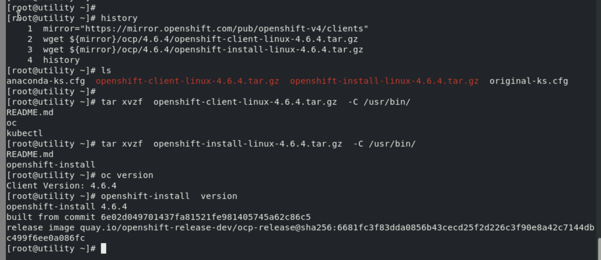
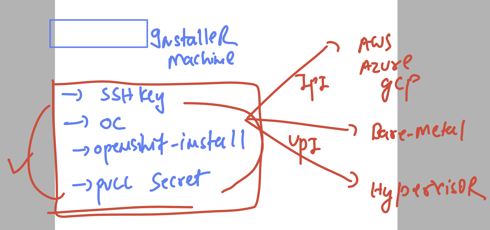
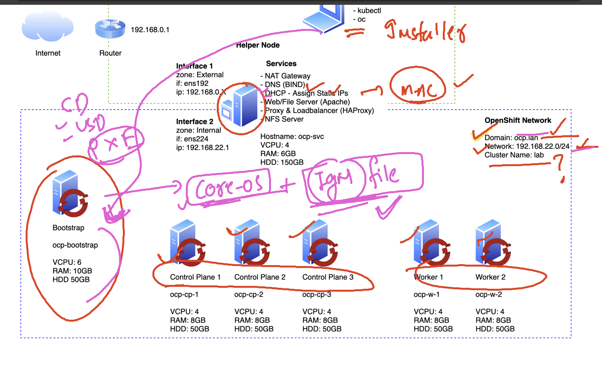
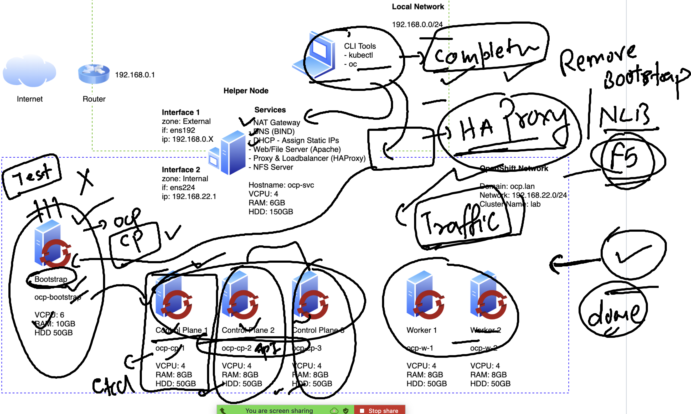

# vm vs container 

### bare-metal to OCP 

## Ocp architecture 

### Control plan APIServer

## TO install openshift -- IPI vs UPI 

### UPI Installer architecture 

### OCP redhat lab env architecture 

## step to Install ocp cluster

### step1 : Downloading Installer , oc cli details 

### STEP 2 : complete installer machine for any kind of installation 

### STEP 3 : prepare Infra Node / network / DNS / boot options  / DHCP 

### use of HA-proxy or F5 Lb during Installation 

