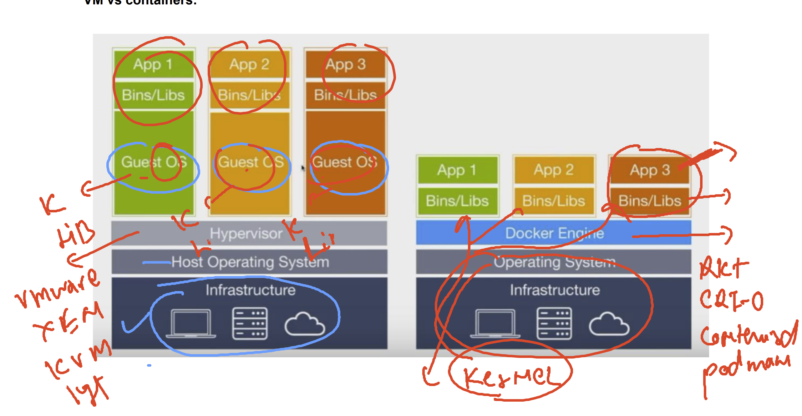
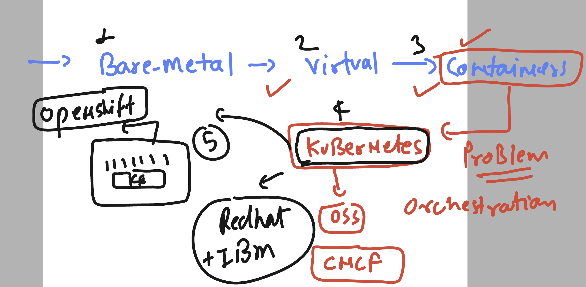
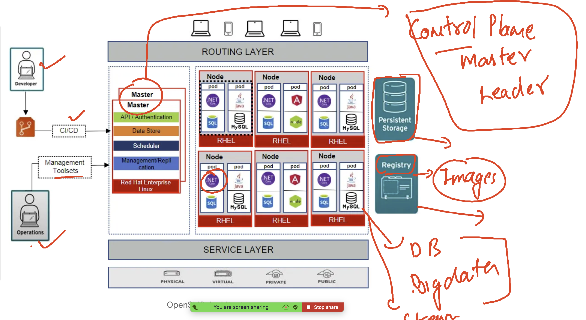
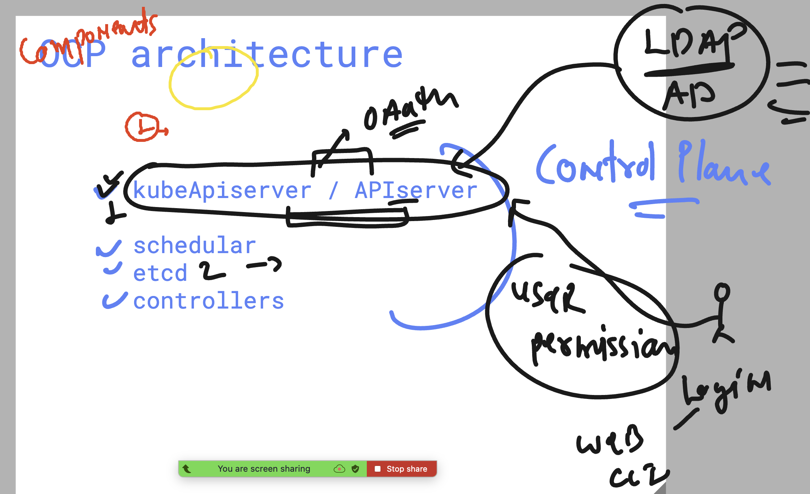
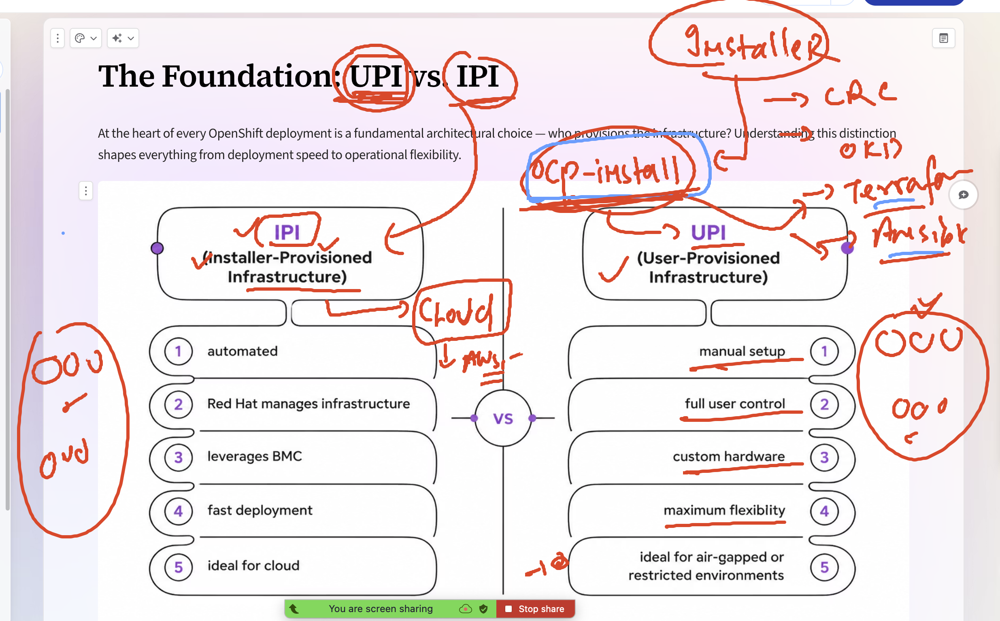
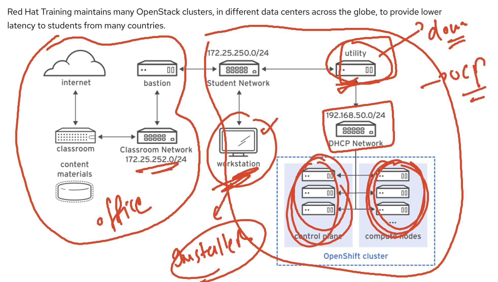
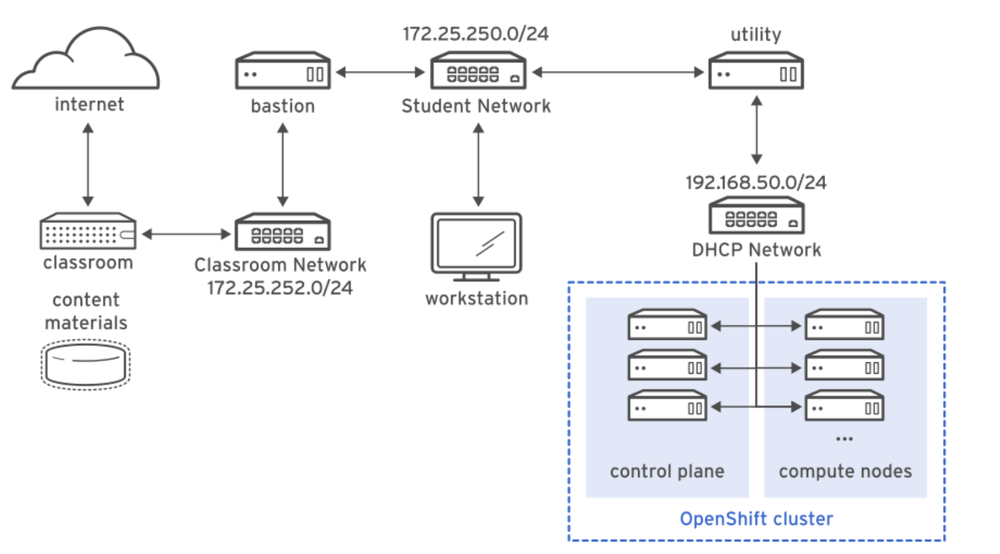

# vm vs container 

### bare-metal to OCP 

## Ocp architecture 

### Control plan APIServer

## TO install openshift -- IPI vs UPI 

### UPI Installer architecture 

### OCP redhat lab env architecture 

