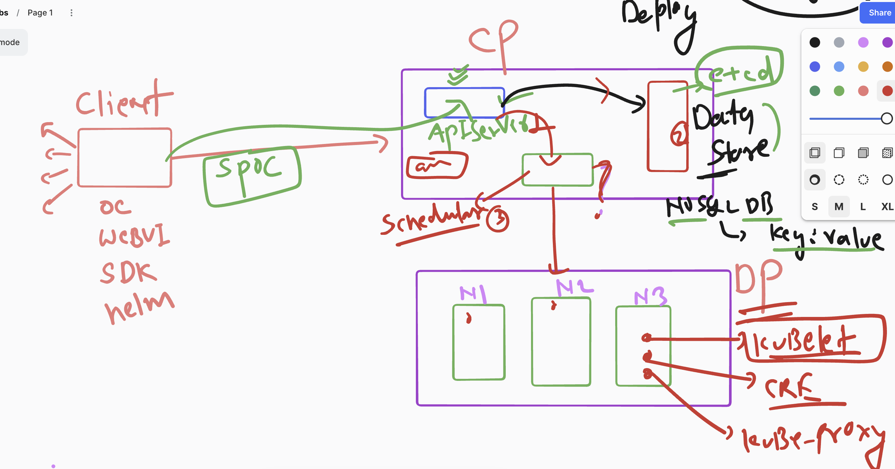
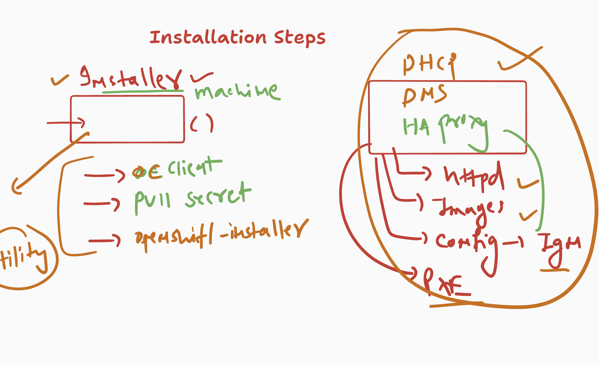
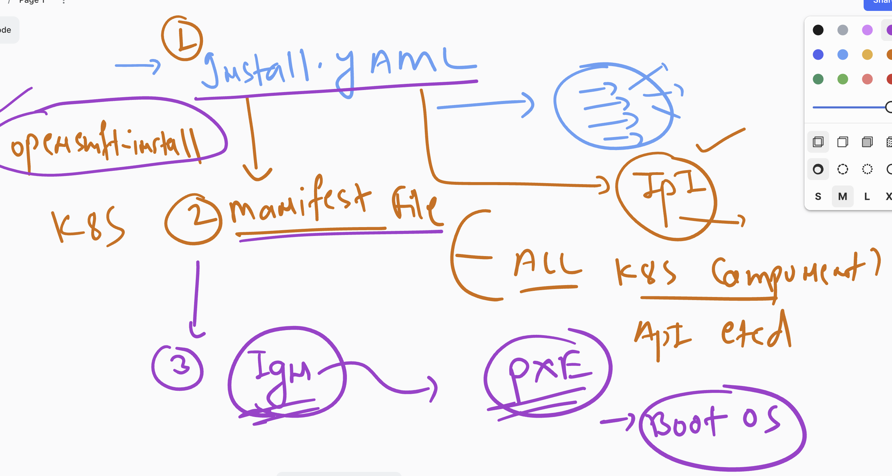
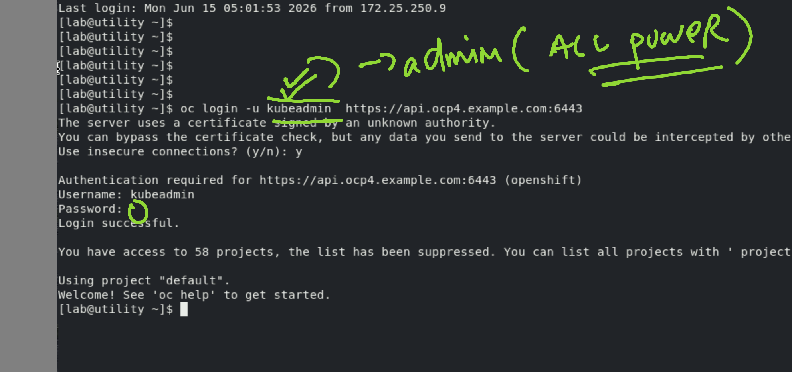
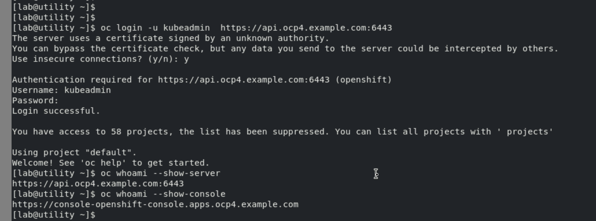
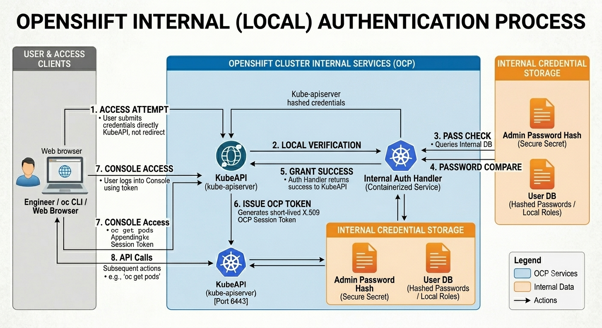
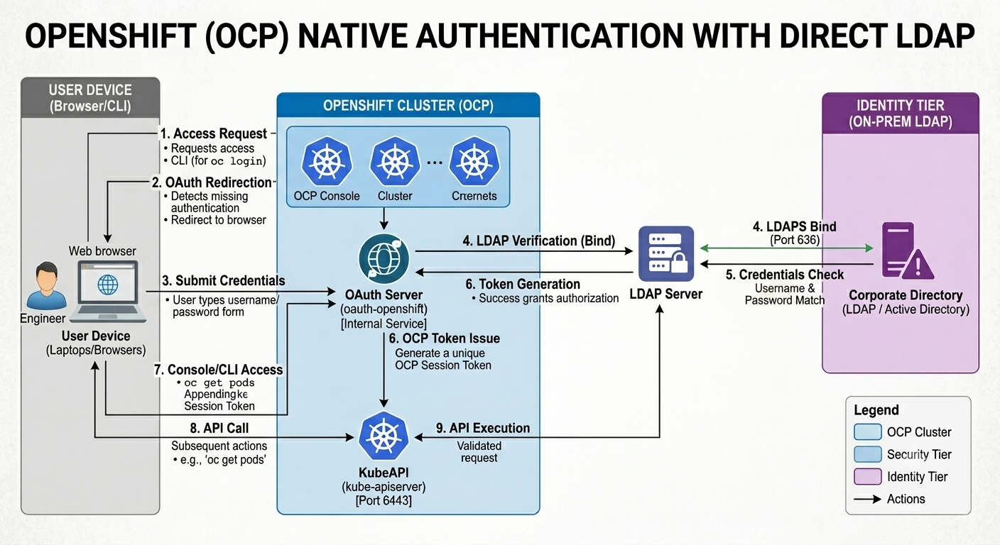
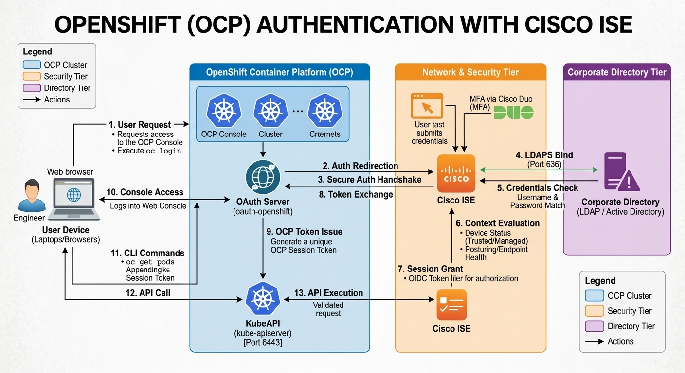

# Revision

### Installer Machine Details

## Using OpenShift Installer to Create

- YAML file
- Manifest files
- IGN files

### LOgin to ocp using oc cli 

### checking more details 

## ocp auth process using APIserver | oauth | CisCO ISE + LDAP 

